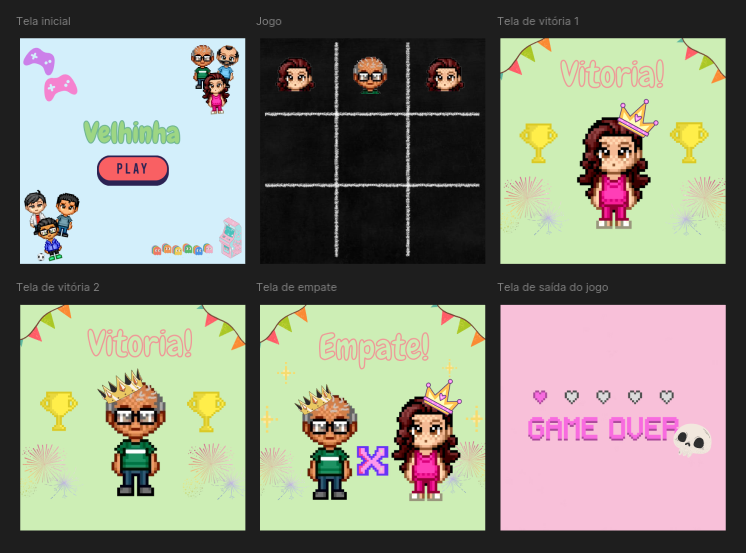

# 🎮 Velhinha — Jogo da Velha com Pygame
Este projeto é uma implementação divertida e visualmente estilizada do clássico jogo da velha (tic-tac-toe), desenvolvido com a biblioteca Pygame. 
Ele apresenta uma interface gráfica com imagens personalizadas, música de fundo e telas de início e fim, proporcionando uma experiência envolvente para dois jogadores locais.

---
 

## 📸 Interface

 

## 🧩 Funcionalidades
- Interface gráfica com imagens para fundo, jogadores e telas de vitória/empate

- Música de fundo contínua durante o jogo

- Alternância automática entre os jogadores "X" e "O"

- Verificação de vitória por linhas, colunas e diagonais

- Detecção de empate

- Tela inicial e tela de fim com transições suaves

- Reinício automático após o fim da partida

 

## 🖼️ Recursos Visuais

- O jogo utiliza imagens personalizadas localizadas na pasta imagens/:

- fundo.jpg: plano de fundo do tabuleiro

- X.png e O.png: peças dos jogadores

- inicio.png: tela inicial

- fim.png: tela de encerramento

- xvenceu.png, ovenceu.png, empatados.png: telas de resultado

- Além disso, uma música de fundo é carregada da pasta musica/ com o arquivo musica.mp3.

 

## 🚀 Como Executar
- Certifique-se de ter o Python instalado (versão 3.6 ou superior).

> Instale a biblioteca Pygame:
>- pip install pygame

> Execute o programa:
>- python3 velhinha.py

 

## 👾 Controles

- Clique com o mouse nas células do tabuleiro para jogar.

- O jogo alterna automaticamente entre os jogadores.

- Após o fim da partida, clique em qualquer lugar para reiniciar.

 

## 📌 Observações

- Este jogo é para dois jogadores locais (não possui IA).

- Certifique-se de que os arquivos de imagem e música estejam corretamente nomeados e localizados nas pastas indicadas.

 

## 📄 Licença
Este projeto é de uso livre para fins educacionais e pessoais. Sinta-se à vontade para modificar e expandir!

